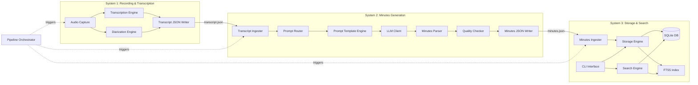
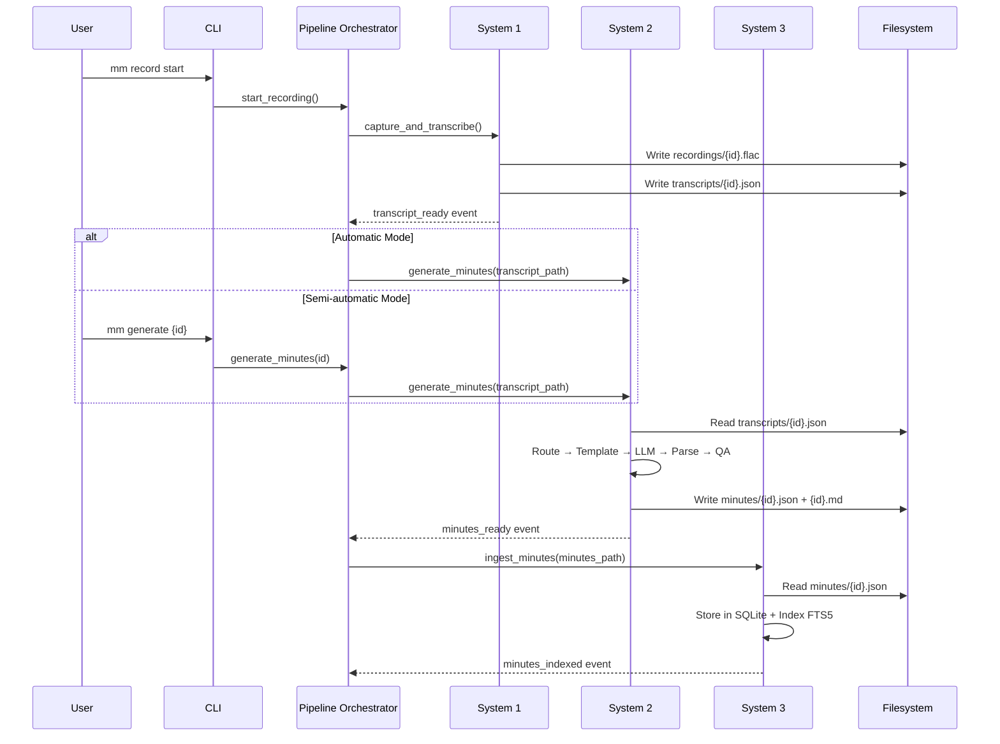

# Design Document: Meeting Minutes Taker

## Overview

The Meeting Minutes Taker is a local-first Python application organized as a three-system pipeline. System 1 captures audio and produces structured transcripts. System 2 generates LLM-powered meeting minutes from those transcripts. System 3 stores everything in SQLite and provides full-text search via a CLI. The systems communicate through JSON files on a shared filesystem, orchestrated by a pipeline coordinator that supports automatic, semi-automatic, and manual modes.

The MVP targets single-user local deployment with:
- `sounddevice` + `faster-whisper` + `pyannote.audio` for audio capture, transcription, and diarization
- Anthropic Claude (with OpenAI fallback) for minutes generation
- SQLite + FTS5 for storage and search
- `typer` CLI as the primary user interface
- `watchdog` for filesystem-based event coordination

## Architecture

### High-Level System Diagram



### Directory Structure

```
meeting-minutes-taker/
├── pyproject.toml
├── config/
│   └── config.yaml                  # Default configuration
├── src/
│   └── meeting_minutes/
│       ├── __init__.py
│       ├── config.py                # Configuration loading & validation
│       ├── models.py                # Shared data models (Pydantic)
│       ├── logging.py               # Structured JSON logging
│       ├── system1/
│       │   ├── __init__.py
│       │   ├── capture.py           # Audio capture engine
│       │   ├── transcribe.py        # Transcription engine (Whisper)
│       │   ├── diarize.py           # Speaker diarization
│       │   └── output.py            # Transcript JSON writer
│       ├── system2/
│       │   ├── __init__.py
│       │   ├── ingest.py            # Transcript ingestion & validation
│       │   ├── router.py            # Meeting type routing
│       │   ├── prompts.py           # Prompt construction (Jinja2)
│       │   ├── llm_client.py        # LLM API client (Anthropic/OpenAI)
│       │   ├── schema.py            # StructuredMinutesResponse (tool_use schema)
│       │   ├── parser.py            # LLM response parser
│       │   ├── quality.py           # Quality assurance checks
│       │   └── output.py            # Minutes JSON/Markdown writer
│       ├── system3/
│       │   ├── __init__.py
│       │   ├── db.py                # SQLAlchemy models & session
│       │   ├── ingest.py            # Minutes ingestion pipeline
│       │   ├── search.py            # FTS5 search engine
│       │   ├── storage.py           # Storage engine (CRUD)
│       │   └── cli.py               # Typer CLI commands
│       ├── env.py                   # .env file loading
│       ├── pipeline.py              # Pipeline orchestrator
│       └── api/                     # FastAPI REST API
│           ├── __init__.py
│           ├── main.py              # App factory, CORS, static files
│           ├── deps.py              # Dependency injection
│           ├── schemas.py           # Pydantic response models
│           ├── ws.py                # WebSocket handlers
│           └── routes/              # Route modules
│               ├── meetings.py
│               ├── search.py
│               ├── actions.py
│               ├── decisions.py
│               ├── people.py
│               ├── stats.py
│               ├── recording.py
│               └── config.py
├── templates/
│   ├── general.md.j2
│   ├── standup.md.j2
│   ├── decision_meeting.md.j2
│   ├── one_on_one.md.j2
│   ├── customer_meeting.md.j2
│   ├── brainstorm.md.j2
│   ├── retrospective.md.j2
│   └── planning.md.j2
├── tests/
│   ├── conftest.py
│   ├── test_config.py
│   ├── test_system1/
│   ├── test_system2/
│   ├── test_system3/
│   └── test_pipeline.py
└── alembic/
    └── ...                          # Database migrations
```

### Pipeline Flow



## Components and Interfaces

### System 1 Components

#### AudioCaptureEngine
- **Responsibility**: Record audio from configured system audio device
- **Interface**:
  ```python
  class AudioCaptureEngine:
      def __init__(self, config: RecordingConfig) -> None: ...
      def start(self) -> str:  # returns meeting_id
          """Begin recording. Creates circular buffer, starts audio stream."""
      def stop(self) -> AudioRecordingResult:
          """Stop recording. Finalize audio file, return metadata."""
      def is_recording(self) -> bool: ...
  ```
- **Dependencies**: `sounddevice`, configuration
- **Output**: FLAC audio file + `AudioRecordingResult` dataclass

#### TranscriptionEngine
- **Responsibility**: Convert audio to text with timestamps and confidence scores
- **Interface**:
  ```python
  class TranscriptionEngine:
      def __init__(self, config: TranscriptionConfig) -> None: ...
      def transcribe(self, audio_path: Path) -> TranscriptionResult:
          """Transcribe audio file. Returns segments with word-level timestamps."""
      def detect_language(self, audio_path: Path) -> str: ...
  ```
- **Dependencies**: `faster-whisper`, configuration
- **Output**: `TranscriptionResult` with segments, full_text, language, confidence scores

#### DiarizationEngine
- **Responsibility**: Identify and label distinct speakers
- **Interface**:
  ```python
  class DiarizationEngine:
      def __init__(self, config: DiarizationConfig) -> None: ...
      def diarize(self, audio_path: Path) -> DiarizationResult:
          """Identify speakers. Returns speaker segments with labels."""
  ```
- **Dependencies**: `pyannote.audio`, configuration
- **Output**: `DiarizationResult` with speaker labels and time ranges

#### TranscriptJSONWriter
- **Responsibility**: Combine transcription + diarization + metadata into Transcript_JSON
- **Interface**:
  ```python
  class TranscriptJSONWriter:
      def write(
          self,
          meeting_id: str,
          recording: AudioRecordingResult,
          transcription: TranscriptionResult,
          diarization: DiarizationResult | None,
          output_dir: Path,
      ) -> Path:
          """Write transcript JSON to output directory. Returns file path."""
  ```
- **Output**: `transcripts/{meeting_id}.json`

### System 2 Components

#### TranscriptIngester
- **Responsibility**: Load and validate Transcript_JSON
- **Interface**:
  ```python
  class TranscriptIngester:
      def ingest(self, transcript_path: Path) -> TranscriptData:
          """Parse, validate, and pre-process transcript JSON."""
  ```
- **Validation**: Schema version check, required fields, segment integrity
- **Pre-processing**: Replace speaker labels with names, merge short segments

#### PromptRouter
- **Responsibility**: Select prompt template based on meeting type
- **Interface**:
  ```python
  class PromptRouter:
      def __init__(self, config: GenerationConfig, templates_dir: Path) -> None: ...
      def select_template(
          self, meeting_type: str, confidence: float, user_override: str | None = None
      ) -> PromptTemplate:
          """Select appropriate template. Falls back to general if no match."""
      def classify_meeting_type(
          self, transcript_excerpt: str, calendar_metadata: dict
      ) -> tuple[str, float]:
          """LLM-based secondary classification when confidence is low."""
  ```
- **Logic**: confidence >= 0.7 → use type; < 0.7 → LLM classify; override → use override; no match → "other"

#### PromptTemplateEngine
- **Responsibility**: Construct the full LLM prompt from template + context + transcript
- **Interface**:
  ```python
  class PromptTemplateEngine:
      def __init__(self, templates_dir: Path) -> None: ...
      def render(
          self, template: PromptTemplate, context: MeetingContext, transcript_text: str
      ) -> str:
          """Render the full prompt using Jinja2 template."""
  ```
- **Dependencies**: `jinja2`

#### LLMClient
- **Responsibility**: Send prompts to LLM and return raw responses
- **Interface**:
  ```python
  class LLMClient:
      def __init__(self, config: LLMConfig) -> None: ...
      async def generate(self, prompt: str, system_prompt: str) -> LLMResponse:
          """Send prompt to configured LLM provider. Returns response with token usage."""
      async def generate_structured(
          self, prompt: str, system_prompt: str, schema: type
      ) -> StructuredLLMResponse:
          """Send prompt with tool_use for guaranteed JSON. Returns structured response."""
  ```
- **Providers**: Anthropic (primary), OpenAI (fallback)
- **Retry**: Up to 3 attempts with exponential backoff
- **Output**: `LLMResponse` with text, token counts, cost, processing time

#### StructuredMinutesAdapter
- **Responsibility**: Convert StructuredMinutesResponse (from tool_use) to ParsedMinutes
- **Interface**:
  ```python
  class StructuredMinutesAdapter:
      def adapt(self, structured: StructuredMinutesResponse) -> ParsedMinutes:
          """Convert structured LLM output to ParsedMinutes format."""
  ```

#### MinutesParser
- **Responsibility**: Parse LLM response into structured minutes data
- **Interface**:
  ```python
  class MinutesParser:
      def parse(self, llm_response: str, meeting_context: MeetingContext) -> ParsedMinutes:
          """Extract summary, sections, action_items, decisions, key_topics from LLM output."""
  ```
- **Output**: `ParsedMinutes` dataclass

#### QualityChecker
- **Responsibility**: Validate generated minutes against quality criteria
- **Interface**:
  ```python
  class QualityChecker:
      def check(
          self, minutes: ParsedMinutes, transcript: TranscriptData
      ) -> QualityReport:
          """Run completeness, length, and hallucination checks."""
  ```
- **Checks**: Speaker coverage, length ratio (10-30%), hallucination detection (names/dates/numbers not in transcript)

#### MinutesJSONWriter
- **Responsibility**: Serialize minutes to JSON and Markdown files
- **Interface**:
  ```python
  class MinutesJSONWriter:
      def write(
          self,
          minutes: ParsedMinutes,
          quality_report: QualityReport,
          llm_metadata: LLMResponse,
          output_dir: Path,
      ) -> tuple[Path, Path]:
          """Write minutes JSON and markdown. Returns (json_path, md_path)."""
  ```

### System 3 Components

#### StorageEngine
- **Responsibility**: CRUD operations on SQLite database
- **Interface**:
  ```python
  class StorageEngine:
      def __init__(self, db_session: Session) -> None: ...
      def upsert_meeting(self, minutes_data: MinutesData) -> Meeting: ...
      def get_meeting(self, meeting_id: str) -> Meeting | None: ...
      def list_meetings(
          self, limit: int = 20, offset: int = 0, filters: MeetingFilters | None = None
      ) -> list[Meeting]: ...
      def delete_meeting(self, meeting_id: str) -> bool: ...
      def upsert_person(self, name: str, email: str) -> Person: ...
      def get_action_items(self, filters: ActionItemFilters | None = None) -> list[ActionItem]: ...
      def update_action_item_status(self, action_id: str, status: str) -> bool: ...
  ```
- **Dependencies**: SQLAlchemy, SQLite

#### SearchEngine
- **Responsibility**: Full-text search using SQLite FTS5
- **Interface**:
  ```python
  class SearchEngine:
      def __init__(self, db_session: Session) -> None: ...
      def search(self, query: SearchQuery) -> SearchResults:
          """Execute FTS5 search with filters. Returns ranked results."""
      def reindex_meeting(self, meeting_id: str) -> None: ...
      def remove_from_index(self, meeting_id: str) -> None: ...
  ```
- **Query parsing**: Extracts structured filters (type:, after:, before:) from free-text query, passes remainder to FTS5

#### MinutesIngester
- **Responsibility**: Orchestrate ingestion of Minutes_JSON into storage + search index
- **Interface**:
  ```python
  class MinutesIngester:
      def __init__(self, storage: StorageEngine, search: SearchEngine) -> None: ...
      def ingest(self, minutes_path: Path) -> str:
          """Parse JSON, store in DB, index for search. Returns meeting_id."""
  ```

#### CLIInterface
- **Responsibility**: Typer-based CLI commands
- **Commands**:
  - `mm search <query> [--type TYPE] [--after DATE] [--before DATE]`
  - `mm list [--person EMAIL]`
  - `mm show <meeting_id>`
  - `mm actions [--owner EMAIL] [--overdue]`
  - `mm actions complete <action_id>`
  - `mm delete <meeting_id>`
  - `mm record start` / `mm record stop`
  - `mm generate <meeting_id>`
  - `mm reprocess <meeting_id>`
- **Dependencies**: `typer`, StorageEngine, SearchEngine, PipelineOrchestrator

### Shared Components

#### ConfigLoader
- **Responsibility**: Load and validate YAML configuration
- **Interface**:
  ```python
  class ConfigLoader:
      @staticmethod
      def load(config_path: Path) -> AppConfig:
          """Load YAML config, apply defaults, validate required fields."""
  ```
- **Validation**: Required fields present, paths exist or creatable, enum values valid
- **Defaults**: All settings have documented defaults

#### StructuredLogger
- **Responsibility**: JSON-formatted structured logging with correlation IDs
- **Interface**:
  ```python
  def get_logger(system_name: str, meeting_id: str | None = None) -> logging.Logger:
      """Return a logger that emits structured JSON with correlation ID."""
  ```

#### PipelineOrchestrator
- **Responsibility**: Coordinate the three systems based on pipeline mode
- **Interface**:
  ```python
  class PipelineOrchestrator:
      def __init__(self, config: AppConfig) -> None: ...
      async def run_full_pipeline(self, meeting_id: str | None = None) -> str: ...
      async def run_transcription(self, meeting_id: str) -> Path: ...
      async def run_generation(self, meeting_id: str) -> Path: ...
      async def run_ingestion(self, meeting_id: str) -> None: ...
      async def reprocess(self, meeting_id: str) -> None: ...
  ```
- **Modes**: automatic (chain all), semi_automatic (S1 auto, S2+S3 manual), manual (each separate)
- **Events**: Uses `watchdog` filesystem watcher in automatic mode

## Data Models

### Pydantic Models (Shared)

```python
from pydantic import BaseModel, Field
from datetime import datetime
from enum import Enum
import uuid

class MeetingType(str, Enum):
    STANDUP = "standup"
    ONE_ON_ONE = "one_on_one"
    DECISION_MEETING = "decision_meeting"
    CUSTOMER_MEETING = "customer_meeting"
    BRAINSTORM = "brainstorm"
    RETROSPECTIVE = "retrospective"
    PLANNING = "planning"
    OTHER = "other"

class ActionItemStatus(str, Enum):
    OPEN = "open"
    IN_PROGRESS = "in_progress"
    DONE = "done"
    CANCELLED = "cancelled"

class ReviewStatus(str, Enum):
    DRAFT = "draft"
    REVIEWED = "reviewed"
    APPROVED = "approved"
```

### Transcript Data Models

```python
class WordTimestamp(BaseModel):
    word: str
    start: float
    end: float
    confidence: float

class TranscriptSegment(BaseModel):
    id: int
    start: float
    end: float
    speaker: str | None = None
    text: str
    words: list[WordTimestamp] = []

class SpeakerMapping(BaseModel):
    label: str          # e.g., "SPEAKER_00"
    name: str | None = None
    email: str | None = None
    confidence: float = 0.0

class TranscriptMetadata(BaseModel):
    timestamp_start: datetime
    timestamp_end: datetime
    duration_seconds: float
    platform: str | None = None
    language: str
    transcription_engine: str
    transcription_model: str
    audio_file: str
    recording_device: str

class TranscriptJSON(BaseModel):
    schema_version: str = "1.0"
    meeting_id: str = Field(default_factory=lambda: str(uuid.uuid4()))
    metadata: TranscriptMetadata
    speakers: list[SpeakerMapping] = []
    meeting_type: str = "other"
    meeting_type_confidence: float = 0.0
    transcript: dict  # contains "segments" and "full_text"
    processing: dict  # contains "created_at", "processing_time_seconds", "pipeline_version"
```

### Minutes Data Models

```python
class ActionItem(BaseModel):
    id: str = Field(default_factory=lambda: f"ai-{uuid.uuid4().hex[:6]}")
    description: str
    owner: str | None = None
    due_date: str | None = None
    priority: str | None = None      # "high" | "medium" | "low"
    status: ActionItemStatus = ActionItemStatus.OPEN
    mentioned_at_seconds: float | None = None
    transcript_segment_ids: list[int] = []

class Decision(BaseModel):
    id: str = Field(default_factory=lambda: f"d-{uuid.uuid4().hex[:6]}")
    description: str
    made_by: str | None = None
    rationale: str | None = None
    confidence: str | None = None     # "high" | "medium" | "low"
    mentioned_at_seconds: float | None = None
    transcript_segment_ids: list[int] = []

class MinutesSection(BaseModel):
    heading: str
    content: str
    type: str | None = None

class MinutesMetadata(BaseModel):
    title: str
    date: str
    duration: str
    attendees: list[str]
    organizer: str | None = None

class LLMUsage(BaseModel):
    provider: str
    model: str
    tokens_used: dict  # {"input": int, "output": int}
    cost_usd: float
    processing_time_seconds: float

class ParticipantInfo(BaseModel):
    name: str
    role: str | None = None
    contribution_summary: str | None = None

class DiscussionPoint(BaseModel):
    topic: str
    description: str
    speaker: str | None = None
    outcome: str | None = None

class RiskConcern(BaseModel):
    description: str
    severity: str | None = None       # "high" | "medium" | "low"
    owner: str | None = None

class FollowUp(BaseModel):
    description: str
    owner: str | None = None
    timeline: str | None = None

class MeetingEffectiveness(BaseModel):
    rating: int | None = None         # 1-5
    notes: str | None = None

class StructuredMinutesResponse(BaseModel):
    """Schema used for Anthropic tool_use structured output."""
    summary: str
    sentiment: str | None = None
    participants: list[ParticipantInfo] = []
    discussion_points: list[DiscussionPoint] = []
    action_items: list[ActionItem] = []
    decisions: list[Decision] = []
    risks_and_concerns: list[RiskConcern] = []
    follow_ups: list[FollowUp] = []
    parking_lot: list[str] = []
    meeting_effectiveness: MeetingEffectiveness | None = None
    key_topics: list[str] = []
    structured_data: dict = {}
    minutes_markdown: str = ""

class MinutesJSON(BaseModel):
    schema_version: str = "1.0"
    meeting_id: str
    minutes_id: str = Field(default_factory=lambda: str(uuid.uuid4()))
    generated_at: datetime
    meeting_type: str
    metadata: MinutesMetadata
    summary: str
    sentiment: str | None = None
    participants: list[ParticipantInfo] = []
    discussion_points: list[DiscussionPoint] = []
    sections: list[MinutesSection]
    action_items: list[ActionItem]
    decisions: list[Decision]
    risks_and_concerns: list[RiskConcern] = []
    follow_ups: list[FollowUp] = []
    parking_lot: list[str] = []
    meeting_effectiveness: MeetingEffectiveness | None = None
    key_topics: list[str]
    structured_data: dict = {}
    minutes_markdown: str
    llm: LLMUsage
```

### SQLAlchemy ORM Models (System 3)

```python
from sqlalchemy import Column, String, Float, DateTime, Text, ForeignKey, Table, Integer
from sqlalchemy.orm import DeclarativeBase, relationship

class Base(DeclarativeBase):
    pass

meeting_attendees = Table(
    "meeting_attendees", Base.metadata,
    Column("meeting_id", String, ForeignKey("meetings.meeting_id")),
    Column("person_id", String, ForeignKey("persons.person_id")),
)

class MeetingORM(Base):
    __tablename__ = "meetings"
    meeting_id = Column(String, primary_key=True)
    title = Column(String)
    date = Column(DateTime)
    duration = Column(String)
    platform = Column(String, nullable=True)
    meeting_type = Column(String)
    organizer = Column(String, nullable=True)
    status = Column(String, default="draft")
    created_at = Column(DateTime)
    updated_at = Column(DateTime)
    transcript = relationship("TranscriptORM", back_populates="meeting", uselist=False)
    minutes = relationship("MinutesORM", back_populates="meeting", uselist=False)
    action_items = relationship("ActionItemORM", back_populates="meeting")
    decisions = relationship("DecisionORM", back_populates="meeting")
    attendees = relationship("PersonORM", secondary=meeting_attendees)

class TranscriptORM(Base):
    __tablename__ = "transcripts"
    meeting_id = Column(String, ForeignKey("meetings.meeting_id"), primary_key=True)
    full_text = Column(Text)
    language = Column(String)
    audio_file_path = Column(String, nullable=True)
    meeting = relationship("MeetingORM", back_populates="transcript")

class MinutesORM(Base):
    __tablename__ = "minutes"
    meeting_id = Column(String, ForeignKey("meetings.meeting_id"), primary_key=True)
    minutes_id = Column(String, unique=True)
    markdown_content = Column(Text)
    summary = Column(Text)
    sentiment = Column(String, nullable=True)
    structured_json = Column(Text, nullable=True)  # Full structured output as JSON
    generated_at = Column(DateTime)
    llm_model = Column(String)
    review_status = Column(String, default="draft")
    meeting = relationship("MeetingORM", back_populates="minutes")

class ActionItemORM(Base):
    __tablename__ = "action_items"
    action_item_id = Column(String, primary_key=True)
    meeting_id = Column(String, ForeignKey("meetings.meeting_id"))
    description = Column(Text)
    owner = Column(String, nullable=True)
    due_date = Column(String, nullable=True)
    priority = Column(String, nullable=True)  # high | medium | low
    status = Column(String, default="open")
    mentioned_at_seconds = Column(Float, nullable=True)
    meeting = relationship("MeetingORM", back_populates="action_items")

class DecisionORM(Base):
    __tablename__ = "decisions"
    decision_id = Column(String, primary_key=True)
    meeting_id = Column(String, ForeignKey("meetings.meeting_id"))
    description = Column(Text)
    made_by = Column(String, nullable=True)
    rationale = Column(Text, nullable=True)
    confidence = Column(String, nullable=True)  # high | medium | low
    mentioned_at_seconds = Column(Float, nullable=True)
    meeting = relationship("MeetingORM", back_populates="decisions")

class PersonORM(Base):
    __tablename__ = "persons"
    person_id = Column(String, primary_key=True)
    name = Column(String)
    email = Column(String, unique=True, nullable=True)
```

### FTS5 Virtual Table

```sql
CREATE VIRTUAL TABLE meetings_fts USING fts5(
    meeting_id UNINDEXED,
    title,
    transcript_text,
    minutes_text,
    content='',
    tokenize='porter unicode61'
);
```

The FTS5 table is a content-less external content table. The `StorageEngine` manages inserts/updates/deletes to keep it in sync with the main tables.

### Search Query Model

```python
class SearchQuery(BaseModel):
    raw_query: str
    fts_query: str = ""           # Extracted FTS5 query portion
    meeting_type: str | None = None
    after_date: datetime | None = None
    before_date: datetime | None = None
    attendee: str | None = None
    action_item_status: str | None = None
    limit: int = 20
    offset: int = 0

class SearchResult(BaseModel):
    meeting_id: str
    title: str
    date: datetime
    meeting_type: str
    snippet: str
    rank: float

class SearchResults(BaseModel):
    results: list[SearchResult]
    total_count: int
    query: SearchQuery
```

### Configuration Models

```python
class RecordingConfig(BaseModel):
    audio_device: str = "auto"
    sample_rate: int = 16000
    format: str = "flac"
    auto_stop_silence_minutes: int = 5

class TranscriptionConfig(BaseModel):
    primary_engine: str = "whisper"
    whisper_model: str = "medium"
    language: str = "auto"
    custom_vocabulary: str | None = None

class DiarizationConfig(BaseModel):
    enabled: bool = True
    engine: str = "pyannote"

class LLMConfig(BaseModel):
    primary_provider: str = "anthropic"
    model: str = "claude-sonnet-4-6-20250514"
    fallback_provider: str | None = "openai"
    fallback_model: str | None = "gpt-4o"
    temperature: float = 0.2
    max_output_tokens: int = 4096
    retry_attempts: int = 3
    timeout_seconds: int = 120

class GenerationConfig(BaseModel):
    llm: LLMConfig = LLMConfig()
    templates_dir: str = "templates"

class StorageConfig(BaseModel):
    database: str = "sqlite"
    sqlite_path: str = "db/meetings.db"

class PipelineConfig(BaseModel):
    mode: str = "automatic"  # automatic | semi_automatic | manual

class AppConfig(BaseModel):
    data_dir: str = "~/MeetingMinutesTaker/data"
    log_level: str = "INFO"
    pipeline: PipelineConfig = PipelineConfig()
    recording: RecordingConfig = RecordingConfig()
    transcription: TranscriptionConfig = TranscriptionConfig()
    diarization: DiarizationConfig = DiarizationConfig()
    generation: GenerationConfig = GenerationConfig()
    storage: StorageConfig = StorageConfig()
```

## Correctness Properties

*A property is a characteristic or behavior that should hold true across all valid executions of a system — essentially, a formal statement about what the system should do. Properties serve as the bridge between human-readable specifications and machine-verifiable correctness guarantees.*

### Property 1: Circular buffer retains most recent samples

*For any* sequence of audio samples written to the circular buffer, the buffer SHALL contain exactly the most recent N samples (where N is the buffer capacity), and no data loss occurs for the retained window.

**Validates: Requirements 1.3**

### Property 2: Meeting ID uniqueness

*For any* number of recordings started, all generated meeting_ids SHALL be valid UUIDs and pairwise distinct.

**Validates: Requirements 1.5**

### Property 3: Recording metadata completeness

*For any* completed recording, the resulting AudioRecordingResult SHALL contain non-null values for meeting_id, start timestamp, end timestamp, duration, audio device name, and sample rate, and duration SHALL equal end timestamp minus start timestamp.

**Validates: Requirements 1.6**

### Property 4: Transcription output completeness

*For any* transcription result, every segment SHALL contain a words array where each word has a start timestamp, end timestamp, and confidence score, and the result SHALL include a detected language string.

**Validates: Requirements 2.3, 2.7**

### Property 5: Transcript JSON schema validity

*For any* Transcript_JSON output, the document SHALL contain all required top-level fields (schema_version, meeting_id, metadata, speakers, meeting_type, transcript) and a processing block with created_at, processing_time_seconds, and pipeline_version.

**Validates: Requirements 4.1, 4.2**

### Property 6: Transcript JSON round-trip

*For any* valid TranscriptJSON Pydantic model instance, serializing to JSON and then parsing back into a TranscriptJSON model SHALL produce an object equal to the original.

**Validates: Requirements 4.4**

### Property 7: Diarization output consistency

*For any* diarization result, every segment SHALL have a speaker label matching the pattern `SPEAKER_XX`, and the reported num_speakers SHALL equal the count of distinct speaker labels across all segments.

**Validates: Requirements 3.2, 3.3**

### Property 8: Transcript schema validation

*For any* JSON document that does not conform to the TranscriptJSON schema, the Minutes_Generator's validation step SHALL reject it, and for any conforming document, validation SHALL accept it.

**Validates: Requirements 5.1**

### Property 9: Speaker label replacement

*For any* transcript containing speaker mappings, after the Minutes_Generator's pre-processing step, no `SPEAKER_XX` labels SHALL remain in the processed transcript text — all SHALL be replaced with the corresponding participant names.

**Validates: Requirements 5.2**

### Property 10: Prompt construction completeness

*For any* valid transcript input, the constructed LLM prompt SHALL contain the system prompt text, the meeting type template content, the meeting context (title, date, attendees), and the transcript text.

**Validates: Requirements 5.3**

### Property 11: Minutes parser extraction

*For any* well-formed LLM response containing summary, sections, action items, decisions, and topics markers, the MinutesParser SHALL extract all five components into the ParsedMinutes structure with no data loss.

**Validates: Requirements 5.4**

### Property 12: Minutes output file creation

*For any* successful minutes generation, both a Minutes_JSON file and a Markdown file SHALL exist at the expected paths in the configured output directory.

**Validates: Requirements 5.5**

### Property 13: Prompt router selection logic

*For any* meeting type string, confidence score, and optional user override: if an override is provided, the router SHALL select the override type's template; else if confidence >= 0.7 and a matching template exists, the router SHALL select that template; else the router SHALL fall back to the "other" template.

**Validates: Requirements 6.1, 6.3, 6.4**

### Property 14: Minutes JSON schema validity

*For any* Minutes_JSON output, the document SHALL contain all required fields (schema_version, meeting_id, minutes_id, generated_at, meeting_type, metadata, summary, sections, action_items, decisions, key_topics, minutes_markdown) and an llm block with provider, model, tokens_used, cost_usd, and processing_time_seconds.

**Validates: Requirements 7.1, 7.2**

### Property 15: Minutes JSON round-trip

*For any* valid MinutesJSON Pydantic model instance, serializing to JSON and then parsing back into a MinutesJSON model SHALL produce an object equal to the original.

**Validates: Requirements 7.4**

### Property 16: Speaker coverage in minutes

*For any* transcript with identified speakers and generated minutes, every speaker name from the transcript SHALL appear at least once in the minutes text.

**Validates: Requirements 8.1**

### Property 17: Minutes length ratio

*For any* generated minutes and its source transcript, the character length of the minutes SHALL be between 10% and 30% of the transcript's character length.

**Validates: Requirements 8.2**

### Property 18: Hallucination detection

*For any* generated minutes and its source transcript, the quality checker SHALL flag every proper noun, date, and number that appears in the minutes but not in the transcript.

**Validates: Requirements 8.3**

### Property 19: Meeting storage round-trip

*For any* valid MinutesJSON, after ingestion into the Storage_Engine, querying the database by meeting_id SHALL return a Meeting record with matching title, date, meeting_type, summary, action items, and decisions.

**Validates: Requirements 9.1**

### Property 20: Attendee person entity creation

*For any* meeting with N attendees, after storage, the meeting record SHALL be linked to exactly N Person_Entity records, each with the correct name and email.

**Validates: Requirements 9.2**

### Property 21: Storage upsert idempotence

*For any* valid MinutesJSON, ingesting it twice with the same meeting_id SHALL result in exactly one Meeting record in the database, not two.

**Validates: Requirements 9.3**

### Property 22: FTS index sync after storage

*For any* stored meeting, searching for a unique term known to exist in its transcript or minutes content SHALL return that meeting in the search results.

**Validates: Requirements 9.4**

### Property 23: FTS phrase matching

*For any* indexed meeting containing a specific multi-word phrase, searching for that exact phrase in double quotes SHALL return that meeting, and meetings not containing the phrase SHALL not be returned.

**Validates: Requirements 10.3**

### Property 24: FTS boolean operators

*For any* two distinct terms A and B and a set of indexed meetings, searching "A AND B" SHALL return only meetings containing both terms, "A OR B" SHALL return meetings containing either, and "A NOT B" SHALL return meetings containing A but not B.

**Validates: Requirements 10.4**

### Property 25: Date range filter

*For any* set of meetings with known dates and a date range [after, before], the Search_Engine SHALL return only meetings whose date falls within the specified range.

**Validates: Requirements 10.5**

### Property 26: Meeting type filter

*For any* set of meetings with known types and a type filter, the Search_Engine SHALL return only meetings matching the specified type.

**Validates: Requirements 10.6**

### Property 27: BM25 ranking order

*For any* search query returning multiple results, the results SHALL be ordered by descending BM25 rank score.

**Validates: Requirements 10.2**

### Property 28: CLI list chronological order

*For any* set of stored meetings, the `mm list` output SHALL present meetings in reverse chronological order (most recent first).

**Validates: Requirements 11.3**

### Property 29: CLI action items filtering

*For any* set of action items with various owners, `mm actions` SHALL return all items with status "open", and `mm actions --owner <email>` SHALL return only open items assigned to that owner.

**Validates: Requirements 11.5, 11.6**

### Property 30: CLI invalid ID error handling

*For any* string that is not a valid meeting_id or action_id in the database, the CLI SHALL return a non-zero exit code and a descriptive error message.

**Validates: Requirements 11.9**

### Property 31: Reprocess idempotence

*For any* meeting_id, reprocessing the pipeline SHALL produce the same final state as a fresh pipeline run — the database and filesystem SHALL contain exactly one set of outputs for that meeting.

**Validates: Requirements 12.5**

### Property 32: Configuration loading round-trip

*For any* valid YAML configuration string, loading it into an AppConfig and then serializing back to YAML SHALL preserve all specified values.

**Validates: Requirements 13.1**

### Property 33: Invalid configuration rejection

*For any* YAML string that is missing required fields or contains invalid values, the ConfigLoader SHALL raise a validation error.

**Validates: Requirements 13.2, 13.4**

### Property 34: Structured log format

*For any* log entry emitted by the system, the entry SHALL be valid JSON containing timestamp, log_level, system_name, and message fields.

**Validates: Requirements 14.1**

### Property 35: Log correlation ID

*For any* log entries emitted while processing a specific meeting, all entries SHALL contain the meeting_id as correlation_id.

**Validates: Requirements 14.2**

### Property 36: Log level filtering

*For any* configured log level, the system SHALL emit only log entries at that level or above (e.g., configuring WARNING suppresses DEBUG and INFO).

**Validates: Requirements 14.3**

### Property 37: Complete meeting deletion

*For any* stored meeting, after deletion by meeting_id: the meeting, transcript, minutes, action items, decisions, and attendee links SHALL be absent from the database; the audio, transcript JSON, and minutes files SHALL be absent from the filesystem; and searching for content unique to that meeting SHALL return no results.

**Validates: Requirements 15.1, 15.2, 15.3**

### Property 38: Structured output schema validity

*For any* valid transcript processed with tool_use, the StructuredMinutesResponse returned by the LLM SHALL parse into a valid Pydantic model without validation errors.

**Validates: Requirements 16.1, 16.2**

### Property 39: Structured output adapter completeness

*For any* valid StructuredMinutesResponse, the StructuredMinutesAdapter SHALL produce a ParsedMinutes object that contains: summary, at least one section, and the same count of action_items and decisions as the input.

**Validates: Requirements 16.3**

### Property 40: Structured output fallback

*For any* failure in structured output generation (API error, validation error, non-Anthropic provider), the system SHALL successfully fall back to text-based generation and produce valid ParsedMinutes.

**Validates: Requirements 17.1, 17.2**

## Error Handling

### System 1 Errors

| Error | Handling |
|-------|----------|
| Audio device unavailable | Log error, raise `AudioDeviceError`. If recording was in progress, save partial audio and mark as incomplete. |
| Audio device fails mid-recording | Save partial audio to FLAC, mark recording as incomplete in metadata, log warning. |
| Whisper model not found | Log error, suggest downloading model. Raise `ModelNotFoundError`. |
| Transcription fails | Retry with fallback engine if configured. If all engines fail, save audio for later reprocessing, log error. |
| Diarization fails | Produce transcript without speaker labels. Set `diarization_failed: true` in Transcript_JSON. Log warning. |
| Disk full during recording | Stop recording gracefully, save what was captured, log error. |

### System 2 Errors

| Error | Handling |
|-------|----------|
| Invalid Transcript_JSON | Raise `ValidationError` with details of which fields are invalid. Log error. |
| LLM API unavailable | Retry with exponential backoff (up to 3 attempts). If primary fails, try fallback provider. If all fail, queue for retry and log error. |
| LLM response malformed | Retry with adjusted prompt (up to 3 attempts). If all retries fail, fall back to general template. Log warning. |
| LLM context window exceeded | Automatically switch to chunking strategy (map-reduce for >2hr, refine for 1-2hr). Log info. |
| Template not found | Fall back to general template. Log warning. |
| Quality check failure | Log warning, include quality report in Minutes_JSON. Do not block output — let user review. |

### System 3 Errors

| Error | Handling |
|-------|----------|
| Invalid Minutes_JSON | Raise `ValidationError`. Log error. |
| Database write failure | Write ingested data to fallback JSON file in a `failed/` directory. Log error with file path for reconciliation. |
| FTS5 index corruption | Rebuild index from database content. Log warning. |
| Meeting not found (for show/delete) | Return descriptive error message. CLI exits with non-zero code. |
| Action item not found | Return descriptive error message. CLI exits with non-zero code. |
| File not found during deletion | Skip missing file, log warning, continue deleting remaining items. |

### Pipeline Errors

| Error | Handling |
|-------|----------|
| Config file missing | Log error with expected path. Exit with non-zero code and descriptive message. |
| Config file invalid YAML | Log parsing error with line number. Exit with non-zero code. |
| Config missing required fields | Log which fields are missing. Exit with non-zero code. |
| System 1 fails in automatic mode | Log error. Do not trigger System 2. Emit `pipeline.failed` event. |
| System 2 fails in automatic mode | Log error. Do not trigger System 3. Emit `pipeline.failed` event. Meeting data from System 1 is preserved. |

## Testing Strategy

### Testing Framework

- **Test runner**: `pytest`
- **Property-based testing**: `hypothesis` (Python)
- **Mocking**: `unittest.mock` + `pytest-mock`
- **Async testing**: `pytest-asyncio`
- **Database testing**: In-memory SQLite for fast tests

### Property-Based Testing Configuration

Each property test uses `hypothesis` with:
- Minimum 100 examples per test (`@settings(max_examples=100)`)
- Custom strategies for generating valid TranscriptJSON, MinutesJSON, and other domain objects
- Each test tagged with a comment referencing the design property:
  ```python
  # Feature: meeting-minutes-taker, Property 6: Transcript JSON round-trip
  ```

### Test Organization

```
tests/
├── conftest.py                    # Shared fixtures, Hypothesis strategies
├── strategies.py                  # Custom Hypothesis strategies for domain models
├── test_system1/
│   ├── test_capture.py            # Audio capture unit tests
│   ├── test_transcribe.py         # Transcription unit tests
│   ├── test_diarize.py            # Diarization unit tests
│   └── test_output.py             # Transcript JSON writer tests + property tests
├── test_system2/
│   ├── test_ingest.py             # Transcript ingestion + validation tests
│   ├── test_router.py             # Prompt router tests + property tests
│   ├── test_prompts.py            # Prompt construction tests
│   ├── test_parser.py             # LLM response parser tests
│   ├── test_quality.py            # Quality checker tests + property tests
│   └── test_output.py             # Minutes JSON writer tests + property tests
├── test_system3/
│   ├── test_storage.py            # Storage engine tests + property tests
│   ├── test_search.py             # Search engine tests + property tests
│   ├── test_ingest.py             # Minutes ingestion tests
│   └── test_cli.py                # CLI command tests
├── test_config.py                 # Configuration loading tests + property tests
├── test_logging.py                # Structured logging tests + property tests
└── test_pipeline.py               # Pipeline orchestration integration tests
```

### Unit Tests

Unit tests cover:
- Specific examples demonstrating correct behavior
- Edge cases (empty inputs, missing fields, boundary values)
- Error conditions (invalid JSON, missing files, API failures)
- Integration points between components (with mocks)

### Property Tests

Property tests cover all 37 correctness properties defined above. Each property is implemented as a single `hypothesis` test with custom strategies. Key strategies include:

- `transcript_json_strategy()`: Generates valid TranscriptJSON instances with random segments, speakers, and metadata
- `minutes_json_strategy()`: Generates valid MinutesJSON instances with random sections, action items, and decisions
- `search_query_strategy()`: Generates valid search queries with random filters
- `config_strategy()`: Generates valid and invalid YAML configurations
- `meeting_type_strategy()`: Generates random meeting types from the supported enum

### Integration Tests

Integration tests (not property-based) cover:
- Full pipeline execution with mocked LLM and audio
- Pipeline mode switching (automatic, semi-automatic, manual)
- Database migration with Alembic
- CLI end-to-end with in-memory database
